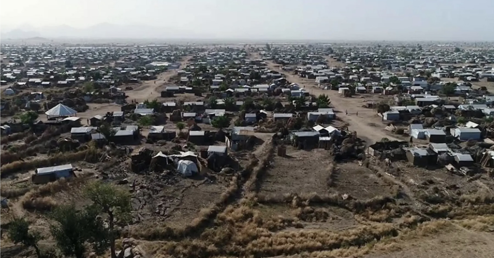

Since its establishment in June 2013, the UNHCR camp of Minawao (Far-North Region of Cameroon) has offered shelter and safety to tens of thousands of people fleeing Boko Haram atrocities in easternmost Nigeria. Its population fluctuates seasonally between 50,000 and 80,000 residents as young adults work in farms across Cameroon-Nigeria border regions during the rainy season.

  
  

Most refugees come from the Gwoza Hills (or Mandara Mountains), one of Africa’s hotspots of linguistic diversity. As a result, more than twenty languages are spoken in the camp. Years of forced cohabitation, compulsory schooling, and subtle processes of social and institutional homogenization have created a situation in which people of different origins live largely in peace and mutual respect. Yet, without dedicated spaces to practice their cultural traditions—and with younger generations growing up far removed from their ancestral homelands—many communities are losing their languages and cultural practices. As one refugee put it: “I may never return to my home and fields in the mountains, but why should I stop being Dghwede, forget my ancestors, or fail to transmit our story to my children?”

This project aims to document two endangered languages spoken in the camp: Cinene and Dghwede. At a deeper level, however, it seeks to build capacity and create the infrastructure needed for speakers of these and any other languages to take a more active role in documenting their heritage and shaping the future of their cultures.

This work builds on findings and relationships developed during preliminary fieldwork in 2023, coordinated by Pierpaolo Di Carlo (then at the University at Buffalo) in collaboration with the University of Maroua and funded by the U.S. National Science Foundation. Since then, Di Carlo has maintained ongoing collaboration with a group of young refugees in the camp through the <a href="https://www.facebook.com/profile.php?id=61563477287476" target="_blank">Minawao Youth</a> initiative. In 2025, the project received a three-year grant from the Endangered Languages Documentation Programme and is now hosted at the University of Naples “L’Orientale”.